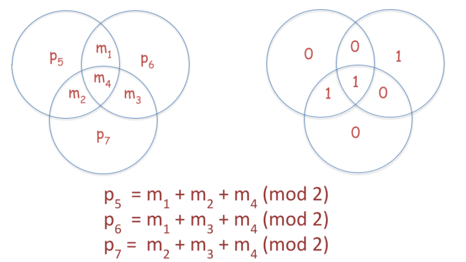

# Theory

In Experiment-2, we provided a brief introduction to linear block codes, their generator and parity-check matrices. In this experiment, we shall focus on a specific class of linear block codes known as Hamming codes. We will describe these codes, calculate the parameters for these codes, give a procedure for encoding and also a procedure for correcting single errors in a Hamming code.

The theory associated with Experiment-3 is divided into two parts:

(1) Encoding
 
(2) Error Correction

## 1 Encoding

We will now describe the encoding of Hamming code through a diagram of 3 circles as shown in Figure

Hamming code is a code over binary field $\mathbb{F}_2$ of length 7, dimension 4 and minimum distance 3. The encoding procedure of the Hamming code is given by the following equations:

Please note that in the above equations, the addition is modulo-2 addition over the binary field. Based on the above equations, the generator matrix of the Hamming code is given by

$G$ = $\begin{align*} 
\begin{bmatrix} 1 & 0 & 0 & 0 & 1 & 1 & 0 \\
                       0 & 1 & 0 & 0 & 1 & 0 & 1 \\
                       0 & 0 & 1 & 0 & 0 & 1 & 1 \\
                       0 & 0 & 0 & 1 & 1 & 1 & 1 \\
       \end{bmatrix}.
\end{align*}$$

The parity-check matrix of the Hamming code can be obtained by rewriting the equations as follows:

$$\begin{align*}
p_5 + m_1 + m_2 + m_4 & = & 0 \\
p_6 + m_1 + m_3 + m_4 & = & 0,\\
p_7 + m_2 + m_3 + m_4 & = & 0.
\end{align*}$$

The parity-check matrix itself is given by
$$\begin{align*}
H = \begin{bmatrix} 1 & 1 & 0 & 1 & 1 & 0 & 0 \\
1 & 0 & 1 & 1 & 0 & 1 & 0 \\
0 & 1 & 1 & 1 & 0 & 0 & 1 \end{bmatrix}.\end{align*}$$

The minimum distance of a Hamming code is 3. This can be seen in one of the following two ways:

- Enumerate all possible codewords of the Hamming code and find the minimum Hamming weight of any codeword. 
- In a second method, the minimum distance of a linear code can be obtained by determining the smallest number $s$ such that any $s$ columns of the parity check matrix are linearly independent. The minimum distance of a code in this case is $s+1$. It can be seen from the parity check matrix of the Hamming code that the smallest number $s$ such that any $s$ columns of the parity check matrix are linearly independent is $2$ and hence the minimum distance of the Hamming code is $3$.

## 2 Error Correction

Let the received binary vector be denoted by $[y_1, y_2, y_3, y_4, y_5, y_6, y_7]$. We will give a decoding rule by which we can correct one error.
Calculate the following quantities

$$\begin{align*}
s_1 & = & y_1 + y_2 + y_4 + y_5 \\
s_2 & = & y_1 + y_3 + y_4 + y_6 \\
s_3 & = & y_2 + y_3 + y_4 + y_7
\end{align*}$$
If $s_1$ is $0$, then it means that the parity equation $p_5 = m_1 + m_2 + m_4$ is said to match and if $s_1$ is $1$, then the parity equation is said to not match.
Similar is the case with $s_2$ and $s_3$.

- ### Case 1: One parity equation does not match:
  If $s_1$ is $1$, then $p_5$ is received erroneously. If $s_2$ is $1$, then $p_6$ is received erroneously. If $s_3$ is $1$, then $p_7$ is received erroneously.
- ### Case 2: Two parity equations do not match: 
  If $s_1 = s_2 = 1$, then $m_1$ is received erroneously. If $s_1 = s_3 = 1$, then $m_2$ is received erroneously. If $s_2 = s_3 = 1$, then $m_3$ is received erroneously.
- ### Case 3: Three parity equations do not match:
  If $s_1 = s_2 = s_3 = 1$, then $m_4$ is received erroneously.

